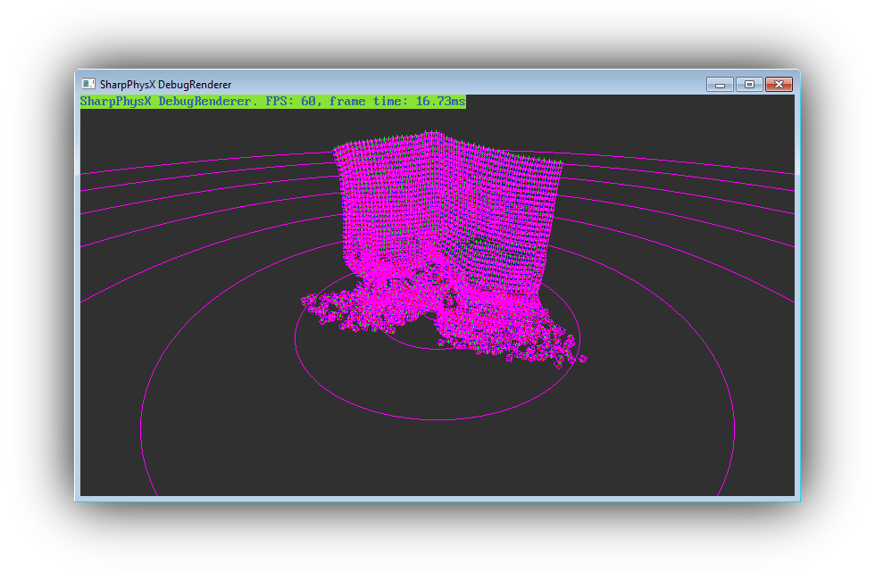

# SharpPhysX

### [YOU CAN ALSO READ THIS DOCUMENTATION HERE](https://alan-fgr.github.io/SharpPhysX)

## Status

### Current state: **Works. API not stable yet.**

Track progress **[here](https://github.com/Alan-FGR/SharpPhysX/projects/1)**.
Items in the Review column are implemented and generally safe to use.

## Building

The projects `SharpPhysX` and `DebugRenderer` are .NET Standard 2.0, so you can include them in any standard compliant project. The project `LibSharpPhysX` is a C++ project to build the native C wrapper library, but prebuilt (win32 x86-64) binaries are provided so you don't have to do that.

There are sample projects preconfigured to build and copy the dependencies to the output folder.

#### .NET Framework
- Check the project `Samples` to see how to build.

#### .NET Core
- CoreCLR : Check the project `Samples.Core`. You can build from Visual Studio.
- CoreRT (AOT): Run the command `dotnet publish -r win-x64 -c debug /p:CoreRT=True` from the Samples.Core directory (cd into it). Change `debug` to `release` in order to produce a release build.

## Description
Nvidia PhysX 4 bindings partially generated using my general-purpose C++ binder [*minBND*](https://github.com/Alan-FGR/minBND).

## API FAQ

### minBND Documentation

Most of the SharpPhysX wrappers and bindings are generated using minBND. For general information about the automatically generated bindings please refer to the [minBND bindings user documentation](https://alan-fgr.github.io/SharpPhysX/?minbnd-docs).

### TODO CLEAR THIS UP - Why are there SomeType**Ptr** using directives in auto generated code that seem mostly redundant/useless?

Pointer holder structs are effectively pointers (AKA opaque pointers). These exist to link generated code and catch pointers to pointers. They don't affect user code in any shape or form.

### Platforms Support

The bindings are .NET Standard 2.0 and the native wrapper should be compilable with any modern C/C++ compiler.
Currently there's a VS solution because of bugs with the CMake integration I don't have time or patience to deal with.
Only supported platform is 64-bit, I don't plan to support 32-bit but that should be very trivial if you need that.
Attention is paid to keep object binary structure compatible. Objects with inheritance are handled as pointers for increase compatibility due to lack of ABI standardization.

## Usage Tips

### Use unmanaged references instead of values for performance

Copying values isn't fast. All operations on blittable types have an overload that takes a pointer, using those overloads should be generally faster than passing by value, so for example instead of calling `somePxVec3.maximum(someOtherVec3)`, call the overload with an unmanaged reference (unsafe code): `somePxVec3.maximum(&someOtherVec3)`. Internally SharpPhysX already uses references for maximum performance, the overload that takes a value is there for convenience (so you can for example new them in place), but for maximum performance you can avoid that value copying. Please note that this can be considered micro-optimization, and since the blittables in SharpPhysX aren't large anyway the difference is certainly going to be *very* marginal in any real-world scenario (think <0.5%).

## Future Plans

### EasyPhysy

This is going to be a high-level abstraction that makes it very easy to use the library.
Not only a very simplified API is planned, but also fully automatic memory management.